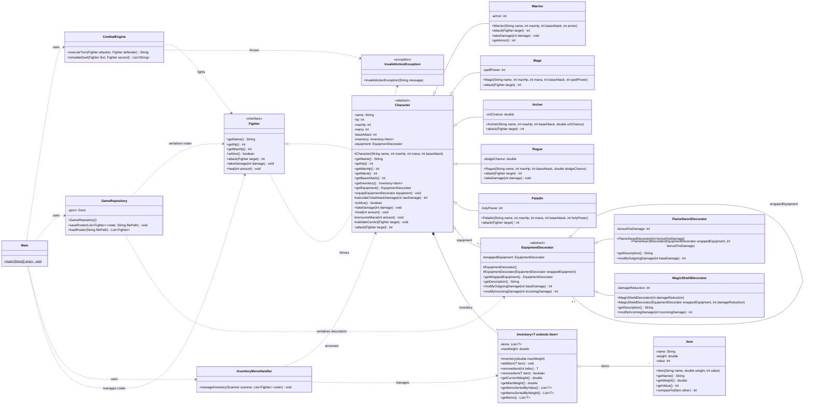

# UML Osztálydiagram

```mermaid
classDiagram
    direction LR

    class Fighter {
        <<interface>>
        +getName() String
        +getHp() int
        +getMaxHp() int
        +isAlive() boolean
        +attack(Fighter target) int
        +takeDamage(int damage) void
        +heal(int amount) void
    }

    class EquipmentDecorator {
        <<abstract>>
        #wrappedEquipment: EquipmentDecorator
        #EquipmentDecorator()
        #EquipmentDecorator(EquipmentDecorator wrappedEquipment)
        +getWrappedEquipment() EquipmentDecorator
        +getDescription() String
        +modifyOutgoingDamage(int baseDamage) int
        +modifyIncomingDamage(int incomingDamage) int
    }

    class FlameSwordDecorator {
        -bonusFireDamage: int
        +FlameSwordDecorator(int bonusFireDamage)
        +FlameSwordDecorator(EquipmentDecorator wrappedEquipment, int bonusFireDamage)
        +getDescription() String
        +modifyOutgoingDamage(int baseDamage) int
    }

    class MagicShieldDecorator {
        -damageReduction: int
        +MagicShieldDecorator(int damageReduction)
        +MagicShieldDecorator(EquipmentDecorator wrappedEquipment, int damageReduction)
        +getDescription() String
        +modifyIncomingDamage(int incomingDamage) int
    }

    class Character {
        <<abstract>>
        -name: String
        -hp: int
        -maxHp: int
        -mana: int
        -baseAttack: int
        -inventory: Inventory~Item~
        -equipment: EquipmentDecorator
        #Character(String name, int maxHp, int mana, int baseAttack)
        +getName() String
        +getHp() int
        +getMaxHp() int
        +getMana() int
        +getBaseAttack() int
        +getInventory() Inventory~Item~
        +getEquipment() EquipmentDecorator
        +equip(EquipmentDecorator equipment) void
        #calculateTotalAttackDamage(int rawDamage) int
        +isAlive() boolean
        +takeDamage(int damage) void
        +heal(int amount) void
        #consumeMana(int amount) void
        #validateCanAct(Fighter target) void
        +attack(Fighter target)* int
    }

    class Warrior {
        -armor: int
        +Warrior(String name, int maxHp, int baseAttack, int armor)
        +attack(Fighter target) int
        +takeDamage(int damage) void
        +getArmor() int
    }

    class Mage {
        -spellPower: int
        +Mage(String name, int maxHp, int mana, int baseAttack, int spellPower)
        +attack(Fighter target) int
    }

    class Archer {
        -critChance: double
        +Archer(String name, int maxHp, int baseAttack, double critChance)
        +attack(Fighter target) int
    }

    class Rogue {
        -dodgeChance: double
        +Rogue(String name, int maxHp, int baseAttack, double dodgeChance)
        +attack(Fighter target) int
        +takeDamage(int damage) void
    }

    class Paladin {
        -holyPower: int
        +Paladin(String name, int maxHp, int mana, int baseAttack, int holyPower)
        +attack(Fighter target) int
    }

    class Item {
        -name: String
        -weight: double
        -value: int
        +Item(String name, double weight, int value)
        +getName() String
        +getWeight() double
        +getValue() int
        +compareTo(Item other) int
    }

    class Inventory~T extends Item~ {
        -items: List~T~
        -maxWeight: double
        +Inventory(double maxWeight)
        +addItem(T item) void
        +removeItem(int index) T
        +removeItem(T item) boolean
        +getCurrentWeight() double
        +getMaxWeight() double
        +getItemsSortedByValue() List~T~
        +getItemsSortedByWeight() List~T~
        +getItems() List~T~
    }

    class CombatEngine {
        +executeTurn(Fighter attacker, Fighter defender) String
        +simulateDuel(Fighter first, Fighter second) List~String~
    }

    class InvalidActionException {
        <<exception>>
        +InvalidActionException(String message)
    }

    class InventoryMenuHandler {
        +manageInventory(Scanner scanner, List~Fighter~ roster) void
    }

    class GameRepository {
        -gson: Gson
        +GameRepository()
        +saveRoster(List~Fighter~ roster, String filePath) void
        +loadRoster(String filePath) List~Fighter~
    }

    class Main {
        +main(String[] args)$ void
    }

    Fighter <|.. Character
    Character <|-- Warrior
    Character <|-- Mage
    Character <|-- Archer
    Character <|-- Rogue
    Character <|-- Paladin

    EquipmentDecorator o-- "0..1" EquipmentDecorator : wrappedEquipment
    EquipmentDecorator <|-- FlameSwordDecorator
    EquipmentDecorator <|-- MagicShieldDecorator

    Character o-- "0..1" EquipmentDecorator : equipment
    Character *-- "1" Inventory : inventory
    Inventory o-- "*" Item : items

    Main ..> CombatEngine : uses
    Main ..> GameRepository : uses
    Main ..> InventoryMenuHandler : uses
    Main ..> Fighter : manages roster
    CombatEngine ..> Fighter : fights
    CombatEngine ..> InvalidActionException : throws
    Fighter ..> InvalidActionException : throws
    InventoryMenuHandler ..> Character : accesses
    InventoryMenuHandler ..> Inventory : manages
    GameRepository ..> Fighter : serializes roster
    GameRepository ..> EquipmentDecorator : serializes decorators
```
