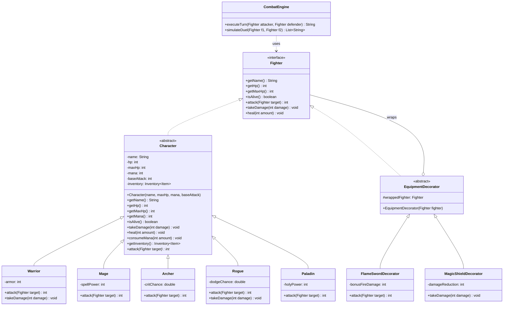

# UML Osztálydiagram (Mermaid)

```mermaid
classDiagram
    class Fighter {
        <<interface>>
        +getName() String
        +getHp() int
        +getMaxHp() int
        +isAlive() boolean
        +attack(Fighter target) int
        +takeDamage(int damage) void
        +heal(int amount) void
    }

    class Character {
        <<abstract>>
        -name: String
        -hp: int
        -maxHp: int
        -mana: int
        -baseAttack: int
        -inventory: Inventory~Item~
        +Character(name, maxHp, mana, baseAttack)
        +getName() String
        +getHp() int
        +getMaxHp() int
        +getMana() int
        +isAlive() boolean
        +takeDamage(int damage) void
        +heal(int amount) void
        +consumeMana(int amount) void
        +getInventory() Inventory~Item~
        +attack(Fighter target)* int
    }

    class Warrior {
        -armor: int
        +attack(Fighter target) int
        +takeDamage(int damage) void
    }

    class Mage {
        -spellPower: int
        +attack(Fighter target) int
    }

    class Archer {
        -critChance: double
        +attack(Fighter target) int
    }

    class Rogue {
        -dodgeChance: double
        +attack(Fighter target) int
        +takeDamage(int damage) void
    }

    class Paladin {
        -holyPower: int
        +attack(Fighter target) int
    }

    class EquipmentDecorator {
        <<abstract>>
        #wrappedFighter: Fighter
        +EquipmentDecorator(Fighter fighter)
    }

    class FlameSwordDecorator {
        -bonusFireDamage: int
        +attack(Fighter target) int
    }

    class MagicShieldDecorator {
        -damageReduction: int
        +takeDamage(int damage) void
    }

    class CombatEngine {
        +executeTurn(Fighter attacker, Fighter defender) String
        +simulateDuel(Fighter f1, Fighter f2) List~String~
    }

    Fighter <|.. Character
    Character <|-- Warrior
    Character <|-- Mage
    Character <|-- Archer
    Character <|-- Rogue
    Character <|-- Paladin
    Fighter <|.. EquipmentDecorator
    EquipmentDecorator o-- Fighter : wraps
    EquipmentDecorator <|-- FlameSwordDecorator
    EquipmentDecorator <|-- MagicShieldDecorator
    CombatEngine ..> Fighter : uses
```
